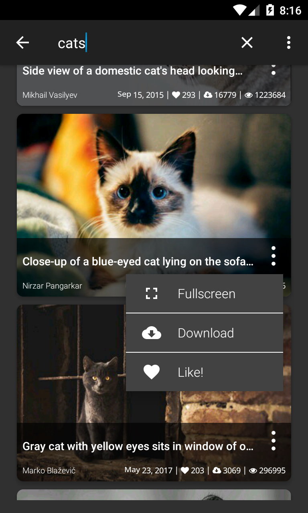
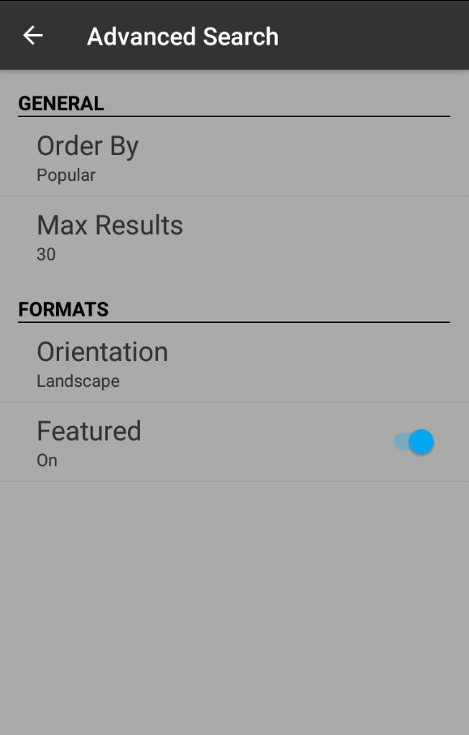
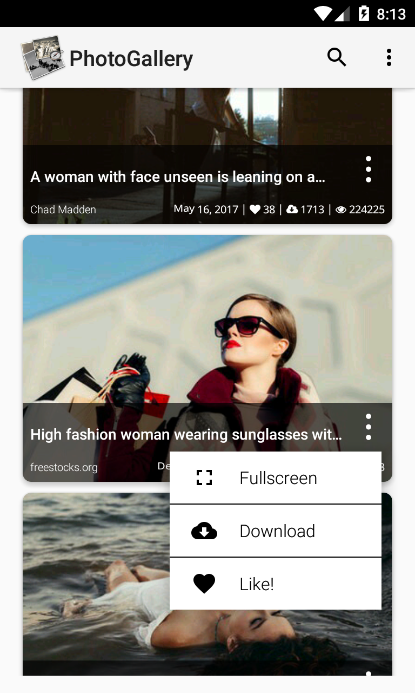

<h1>PhotoGallery</h1>

App created for Udacity.com in the course: Google Challenge Scholarship: Android Developer
 
<i>Skill level</i>: <b>intermediate</b>

After I have completed the lesson 07.23 "Preference Summary", I thought to build an app just for practicing what I learned so far.

This app implements a recyclerView and viewHolder of a list of pictures fetched via an HTTP request from <a href="https://unsplash.com/" rel="nofollow">Unsplash.com</a> 
and also includes: 

<ul>
<li>A searcView on the actionBar, in which the instant search is deactivated, because the free API Key included into the <a href="photogallery.apk">apk</a> 
allows only 50 requests per hour.</li>
<li>An advanced search to filter the results with Order By, Max Results and so 
on.</li>
<li>Dark and Light Theme switchables in settings.</li>
<li>The image are displayed using the Image Loader Library <a href="https://github.com/bumptech/glide">Glide</a>, which it handles image loading/caching.</li>
<li>A downloading function, that allows to save the image to your device.</li>
	<li>A full screen activity, which uses the library <a href="https://github.com/chrisbanes/PhotoView">PhotoView</a> that implements a zooming Android ImageView.</li>
</ul>

The API Key is not included in the project but only into the apk file, just 
for allowing to try it.

Here some screenshots:

  
  
  

Here an example of a zooming Android ImageView:

  

  

  
