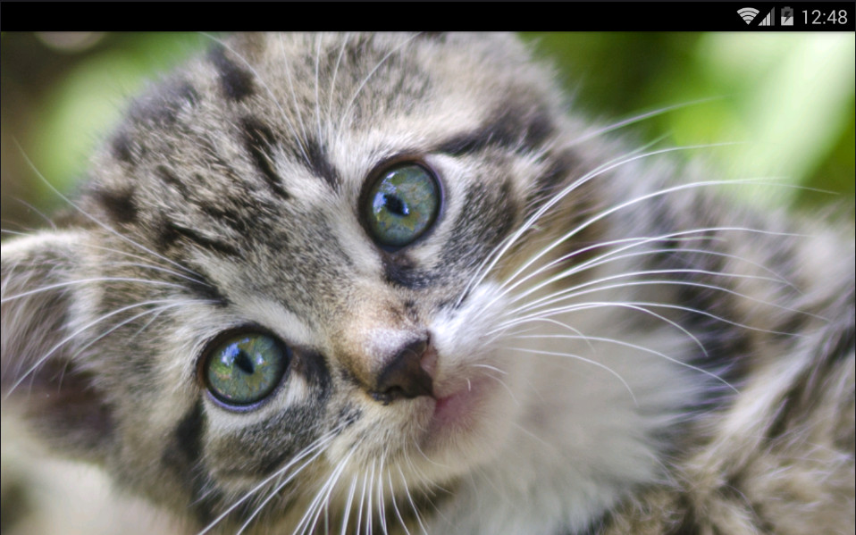

<h1>PhotoGallery</h1>

App created for Udacity.com in the course: Google Challenge Scholarship: Android Developer
 
Skill level: <b>intermediate</b>

Now I have just completed the lesson 07.23 "Preference Summary" and I thought to build an app just for practing what I learned so far. The idea was just to implement a recyclerView and viewHolder of a list of data fetched via an HTTP request.
This app fetchs a list of pictures available on <a href="https://unsplash.com/" rel="nofollow">Unsplash.com</a>.
A searcView is been implemented on the actionBar, in which the instant search is deactivated, because the free API Key included into the <a href="/Giusan82/PhotoGallery/blob/master/photogallery.apk">apk</a> allows only 50 requests per hour. The API Key is not included in the project but only in the apk, just for allowing to try it. Moreover I added an advanced search for filter the results with Order By, Max Results and for orientation. The image are displayed using the Image Loader Library <a href="https://github.com/bumptech/glide">Glide</a>, which it handles image loading/caching. A downloading function is included, that allows to save the image in your device.

Here some screenshots:

  
  
  

An fullscreen activity is also added, which use the library <a href="https://github.com/chrisbanes/PhotoView">PhotoView</a> that implements a zooming Android ImageView.

  

  

  
